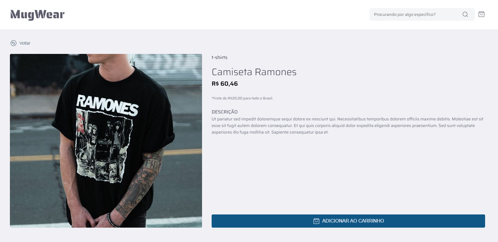
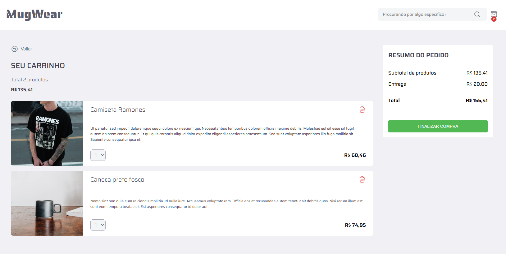

# MugWear

Bem-vindo a MugWear! Este é um projeto e-commerce desenvolvido para lojas de roupas e acessórios.

|  |  |  |  |  |  |
| ---------------------------- | ---------------------------- | ---------------------------- | ---------------------------- | ---------------------------- | ---------------------------- |

[Linkedin Post](https://www.linkedin.com/posts/josiasbroch_nextjs-typescript-graphiql-activity-7300179815779708930-HX7U?utm_source=share&utm_medium=member_desktop&rcm=ACoAADlRdAMBKY74vEDZtFxqewys63zNrB0PecY)

## Visão Geral

A MugWear é uma plataforma de e-commerce desenvolvida para lojas de roupas e acessórios. O projeto foi criado para proporcionar uma experiência de compra intuitiva e eficiente, permitindo que os clientes naveguem por um catálogo variado, explorem detalhes dos produtos e finalizem suas compras com facilidade.
Com uma interface moderna e responsiva, a MugWear oferece um fluxo de compra simplificado, garantindo praticidade tanto para os clientes quanto para os administradores da loja.

## Funcionalidades

- Catálogo de produtos
- Categorias
- Detalhes de Produtos
- Busca por nome do produto
- Carrinho de Compras: Adicionar, atualizar e remover itens
- Checkout
- Responsivo em diferentes telas

## Tecnologias Utilizadas

- Next.js
- TypeScript
- HTML
- CSS
- Styled Components
- GraphQL

## Modo de instalação

Clone este repositório em seu terminal:

```bash
git clone https://github.com/brochjosias/loja-commerce.git
```

**BACK-END:**

```bash
cd api
```

Instale as Dependências:

```bash
npm install
```

Inicie o back-end:

```bash
npm start

```

**FRONT-END:**

```bash
cd front
```

Instale as Dependências:

```bash
npm install
```

Inicie o Front-end:

```bash
npm run dev
```

Assim que carregar, o sistema será exibido no seu navegador padrão.
